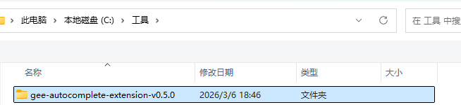
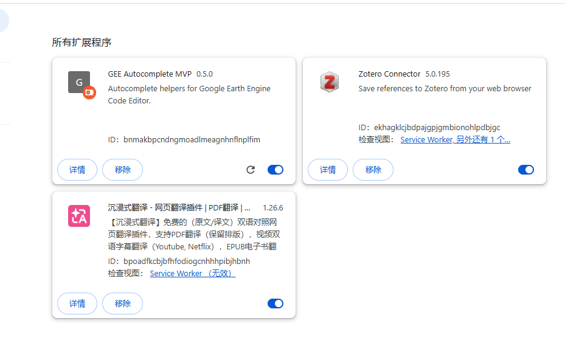
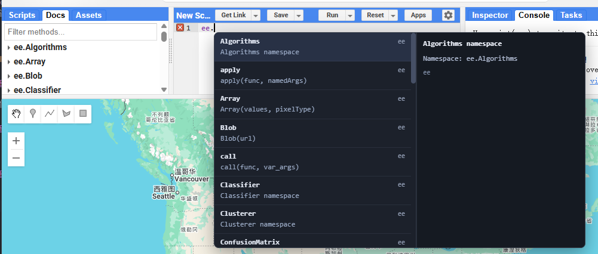

# GEE自动补全插件
## 1.安装操作：
### （1）谷歌浏览器：
- 第一步：输入网址：chrome://extensions/
- 第二步：在网址里打开右边**开发者模式**

- 第三步：点击左上角“**加载未打包的扩展程序**”

- 第四步：选择解压后的文件夹

然后就可以加载成功了

## 2.实现效果
1. 可以显示出所有的函数，比如输入`ee.`,就会弹出后面的函数
利用方向键：`↑`,'↓'进行选择
利用`Enter`键进行确定

2. 可以实现自定义变量的自动补全

-----------------------------
后续更新，敬请期待...
by  **CP**
